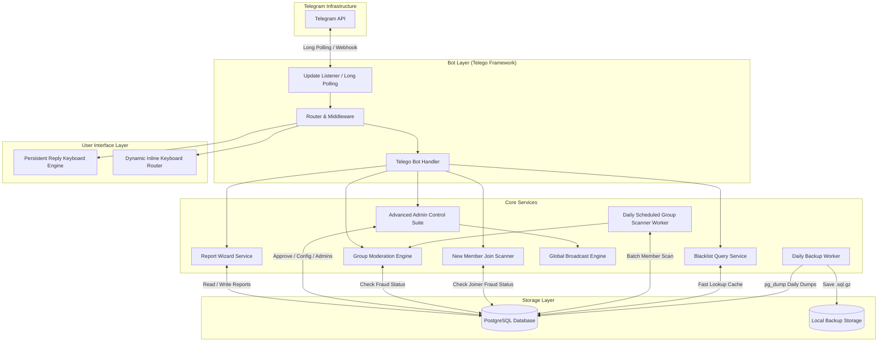
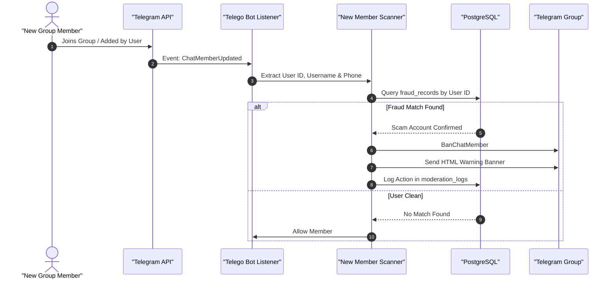
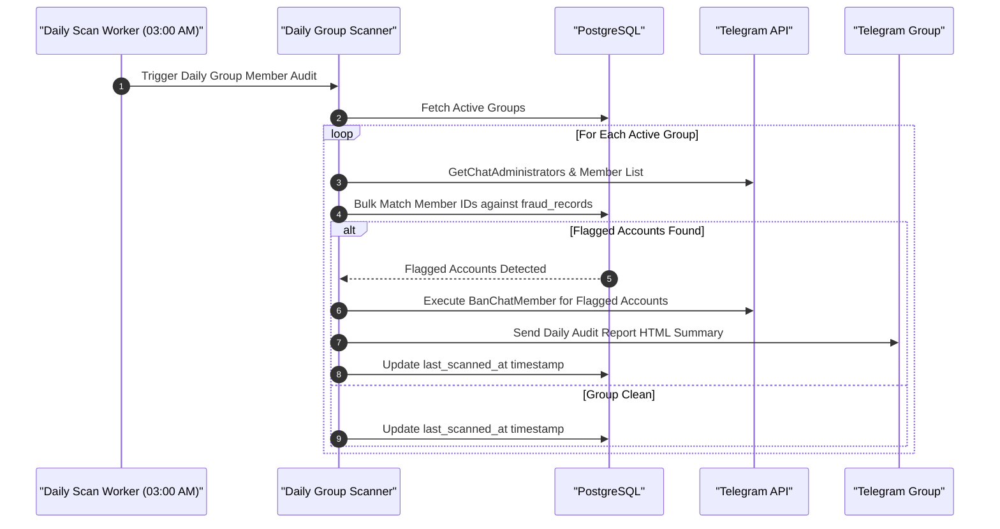
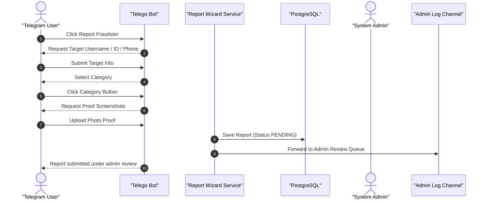
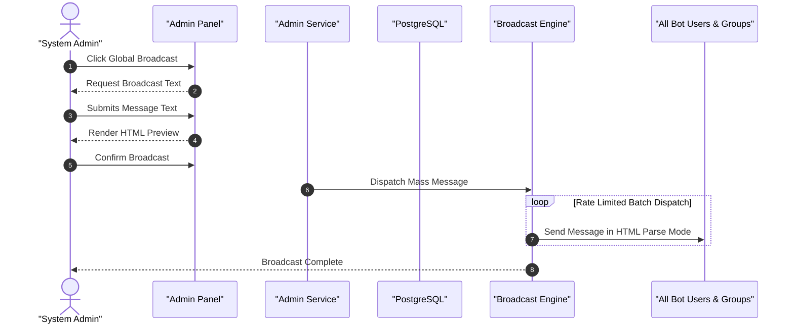

# 🏗️ System Architecture - @telefraudbot

This document details the high-level architecture, module decomposition, event flow, and sequence interactions for **@telefraudbot**.

---

## 📐 Overall Architecture Diagram

---

## 🧩 Component Decomposition

### 1. Bot & UI Layer (`internal/bot`, `internal/ui`)
- **Telego Framework (`github.com/mymmrac/telego`)**: High-performance Telegram Bot API framework.
- **Reply Keyboard System**: Renders persistent bottom navigation buttons (`🛡️ Report Fraudster`, `🔍 Check Identifier`, `📋 My Submissions`, `👨‍💻 Developer Info`).
- **Inline Keyboard System**: Handles stateful multi-step wizards, admin approval queues, group settings toggles, and report cleanup confirmations.
- **HTML Renderer & Sanitizer**: Ensures output formatting complies with `telego.ModeHTML` and escapes user input via `html.EscapeString()`.

### 2. Group Scanner & Protection Engines (`internal/services/moderation`)
- **Real-Time Message Interceptor**: Inspects sender ID, username, and message body text in group chats.
- **New Member Join Scanner (`OnChatMemberUpdated`)**: Triggers instantly when a user joins or is added to a group. Auto-bans verified fraudsters on entry.
- **Daily Automated Group Scanner (`Cron Worker`)**: Scheduled background worker running daily at 03:00 AM UTC. Scans member lists of all registered groups.

### 3. Advanced Admin Suite & Storage (`internal/services/admin`, `internal/database`)
- **Admin Management Service**: Dynamic admin role assignment, permission checks, and audit logging.
- **Global Broadcast Engine**: Asynchronous chunked mass messaging with live progress tracking and Telegram rate limit throttling.
- **Import/Export Service**: Bulk import/export of fraud records in CSV and JSON formats.
- **Database Pool (`pgx/v5`)**: High-concurrency PostgreSQL connection pool.
- **Daily Backup Manager**: Automated background worker running `pg_dump` with gzip compression and Telegram alert delivery.

---

## 🔄 Core Event Sequence Diagrams

### 1. New Member Join Scan Sequence (`OnChatMemberUpdated`)

---

### 2. Scheduled Daily Group Scan Sequence

---

### 3. User PM Report & Proof Upload Flow

---

### 4. Admin Approval & Global Broadcast Engine

