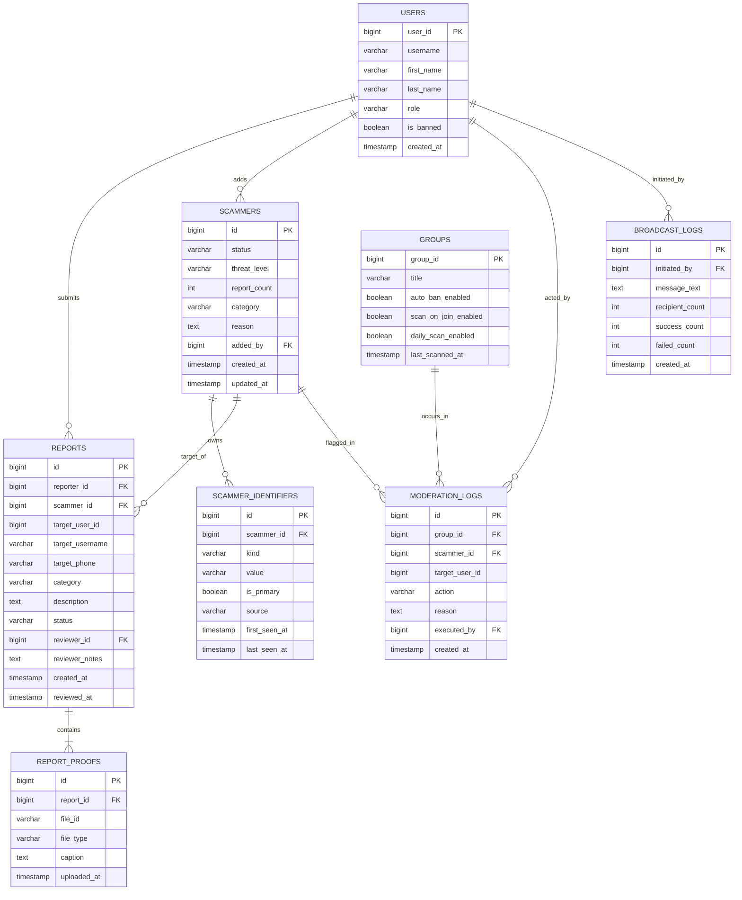

# 🗄️ Database Schema Specification - PostgreSQL

This document defines the relational database model, DDL migrations, index optimizations, and query performance guidelines for **@telefraudbot**.

> **Core idea — identity, not identifiers.** A scammer is not a single username. Telegram exposes three ways to pin an account: the immutable numeric **User ID**, the changeable **@username**, and a changeable **phone number**. The schema therefore models a scammer as a canonical *entity* (`scammers`) that owns a set of *linked identifiers* (`scammer_identifiers`). A scammer who changes their username keeps their old and new handles attached to the same entity, so neither lookup nor auto-ban misses them.

---

## 🧠 Identity Resolution Model

| Concept | Table | Purpose |
| :--- | :--- | :--- |
| Canonical entity | `scammers` | One row per real-world scammer. Holds status, threat level, report count, reason — no identifiers. |
| Linked identifiers | `scammer_identifiers` | Every known `user_id`, `username`, or `phone` for an entity. `(kind, value)` is globally unique. |

The application resolves any input (username, user id, or phone) to the canonical `scammers` row by matching `scammer_identifiers`. When a new identifier is discovered for a known entity it is *linked*; when two entities are found to share identifiers they are *merged* into the older row.

---

## 📊 Entity Relationship Diagram (ERD)



---

## 📜 Full DDL SQL Schema

```sql
-- 0001_init.sql — identity-aware schema for @telefraudbot
-- Idempotent: safe to re-run (CREATE ... IF NOT EXISTS).

-- 1. Users — registered bot users and system admins.
CREATE TABLE IF NOT EXISTS users (
    user_id     BIGINT PRIMARY KEY,
    username    VARCHAR(64),
    first_name  VARCHAR(128) NOT NULL,
    last_name   VARCHAR(128),
    role        VARCHAR(32)  NOT NULL DEFAULT 'USER', -- 'USER' | 'ADMIN' | 'SUPERADMIN'
    is_banned   BOOLEAN      NOT NULL DEFAULT FALSE,
    created_at  TIMESTAMPTZ  NOT NULL DEFAULT NOW(),
    updated_at  TIMESTAMPTZ  NOT NULL DEFAULT NOW()
);

-- 2. Scammers — canonical fraudster entity.
CREATE TABLE IF NOT EXISTS scammers (
    id            BIGSERIAL   PRIMARY KEY,
    status        VARCHAR(32) NOT NULL DEFAULT 'PENDING', -- 'PENDING' | 'VERIFIED' | 'SUSPICIOUS' | 'CLEARED'
    threat_level  VARCHAR(32) NOT NULL DEFAULT 'MEDIUM',  -- 'LOW' | 'MEDIUM' | 'HIGH' | 'CRITICAL'
    report_count  INT         NOT NULL DEFAULT 1,
    category      VARCHAR(64),
    reason        TEXT        NOT NULL,
    added_by      BIGINT      REFERENCES users(user_id) ON DELETE SET NULL,
    created_at    TIMESTAMPTZ NOT NULL DEFAULT NOW(),
    updated_at    TIMESTAMPTZ NOT NULL DEFAULT NOW()
);

-- 3. Scammer identifiers — every known handle/number tied to one scammer.
CREATE TABLE IF NOT EXISTS scammer_identifiers (
    id            BIGSERIAL   PRIMARY KEY,
    scammer_id    BIGINT      NOT NULL REFERENCES scammers(id) ON DELETE CASCADE,
    kind          VARCHAR(16) NOT NULL CHECK (kind IN ('user_id', 'username', 'phone')),
    value         VARCHAR(64) NOT NULL,
    is_primary    BOOLEAN     NOT NULL DEFAULT FALSE,
    source        VARCHAR(32) NOT NULL DEFAULT 'REPORT', -- 'REPORT' | 'JOIN_SCAN' | 'ADMIN' | 'IMPORT'
    first_seen_at TIMESTAMPTZ NOT NULL DEFAULT NOW(),
    last_seen_at  TIMESTAMPTZ NOT NULL DEFAULT NOW(),
    CONSTRAINT uq_scammer_identifiers UNIQUE (kind, value)
);

-- 4. Reports — user submissions awaiting admin review.
CREATE TABLE IF NOT EXISTS reports (
    id              BIGSERIAL   PRIMARY KEY,
    reporter_id     BIGINT      NOT NULL REFERENCES users(user_id) ON DELETE CASCADE,
    scammer_id      BIGINT      REFERENCES scammers(id) ON DELETE SET NULL,
    target_user_id  BIGINT,
    target_username VARCHAR(64),
    target_phone    VARCHAR(32),
    category        VARCHAR(64) NOT NULL,
    description     TEXT        NOT NULL,
    status          VARCHAR(32) NOT NULL DEFAULT 'PENDING', -- 'PENDING' | 'APPROVED' | 'REJECTED' | 'INFO_REQUESTED'
    reviewer_id     BIGINT      REFERENCES users(user_id) ON DELETE SET NULL,
    reviewer_notes  TEXT,
    created_at      TIMESTAMPTZ NOT NULL DEFAULT NOW(),
    reviewed_at     TIMESTAMPTZ
);

-- 5. Report proofs — media attachments.
CREATE TABLE IF NOT EXISTS report_proofs (
    id             BIGSERIAL    PRIMARY KEY,
    report_id      BIGINT       NOT NULL REFERENCES reports(id) ON DELETE CASCADE,
    file_id        VARCHAR(255) NOT NULL,
    file_unique_id VARCHAR(255),
    file_type      VARCHAR(32)  NOT NULL, -- 'PHOTO' | 'DOCUMENT' | 'VIDEO' | 'AUDIO'
    caption        TEXT,
    uploaded_at    TIMESTAMPTZ  NOT NULL DEFAULT NOW()
);

-- 6. Groups — Telegram groups protected by the bot.
CREATE TABLE IF NOT EXISTS groups (
    group_id            BIGINT       PRIMARY KEY,
    title               VARCHAR(255) NOT NULL,
    username            VARCHAR(64),
    auto_ban_enabled    BOOLEAN      NOT NULL DEFAULT TRUE,
    auto_delete_enabled BOOLEAN      NOT NULL DEFAULT TRUE,
    scan_on_join_enabled BOOLEAN     NOT NULL DEFAULT TRUE,
    daily_scan_enabled  BOOLEAN      NOT NULL DEFAULT TRUE,
    warn_on_detected    BOOLEAN      NOT NULL DEFAULT TRUE,
    last_scanned_at     TIMESTAMPTZ,
    joined_at           TIMESTAMPTZ  NOT NULL DEFAULT NOW(),
    updated_at          TIMESTAMPTZ  NOT NULL DEFAULT NOW()
);

-- 7. Moderation logs — audit trail for group enforcement.
CREATE TABLE IF NOT EXISTS moderation_logs (
    id             BIGSERIAL   PRIMARY KEY,
    group_id       BIGINT      REFERENCES groups(group_id) ON DELETE CASCADE,
    scammer_id     BIGINT      REFERENCES scammers(id) ON DELETE SET NULL,
    target_user_id BIGINT      NOT NULL,
    action         VARCHAR(32) NOT NULL, -- 'BAN' | 'KICK' | 'DELETE_MESSAGE' | 'WARN'
    reason         TEXT        NOT NULL,
    executed_by    BIGINT      NOT NULL,
    created_at     TIMESTAMPTZ NOT NULL DEFAULT NOW()
);

-- 8. System settings — dynamic configuration.
CREATE TABLE IF NOT EXISTS system_settings (
    key        VARCHAR(64) PRIMARY KEY,
    value      TEXT        NOT NULL,
    updated_at TIMESTAMPTZ NOT NULL DEFAULT NOW()
);

INSERT INTO system_settings (key, value) VALUES
    ('ENFORCEMENT_MODE', 'BAN'),
    ('DEVELOPER_NAME', 'xspoilt'),
    ('DEVELOPER_USERNAME', '@xspoilt')
ON CONFLICT (key) DO NOTHING;

-- 9. Broadcast logs — history of admin announcements.
CREATE TABLE IF NOT EXISTS broadcast_logs (
    id              BIGSERIAL   PRIMARY KEY,
    initiated_by    BIGINT      NOT NULL REFERENCES users(user_id) ON DELETE CASCADE,
    message_text    TEXT        NOT NULL,
    recipient_count INT         NOT NULL DEFAULT 0,
    success_count   INT         NOT NULL DEFAULT 0,
    failed_count    INT         NOT NULL DEFAULT 0,
    created_at      TIMESTAMPTZ NOT NULL DEFAULT NOW()
);
```

---

## ⚡ Indexing & Performance Strategy

```sql
-- The UNIQUE (kind, value) constraint on scammer_identifiers already provides
-- the primary O(1) identifier lookup used by /check and the join gate.
CREATE INDEX IF NOT EXISTS idx_scammer_identifiers_scammer ON scammer_identifiers(scammer_id);
CREATE INDEX IF NOT EXISTS idx_scammers_status ON scammers(status) WHERE status = 'VERIFIED';
CREATE INDEX IF NOT EXISTS idx_groups_daily_scan ON groups(group_id) WHERE daily_scan_enabled = TRUE;
CREATE INDEX IF NOT EXISTS idx_reports_status ON reports(status, created_at DESC);
CREATE INDEX IF NOT EXISTS idx_reports_reporter ON reports(reporter_id);
CREATE INDEX IF NOT EXISTS idx_proofs_report_id ON report_proofs(report_id);
CREATE INDEX IF NOT EXISTS idx_mod_logs_group ON moderation_logs(group_id, created_at DESC);
```

### Resolution queries

Identifier normalization happens in the application (`internal/models`): usernames are lowercased and stripped of `@`, phone numbers are reduced to `+<digits>`, user ids are validated as positive `int64`. Lookups are then a single indexed equality match:

```sql
SELECT * FROM scammer_identifiers WHERE kind = $1 AND value = $2;
```

When one input resolves to multiple `scammer_id`s (e.g. a report carrying both a username and a user id that were previously recorded separately), the resolver merges the entities: identifiers are re-pointed to the older entity, duplicate identifiers dropped, report counts summed, and the stronger threat level kept.
